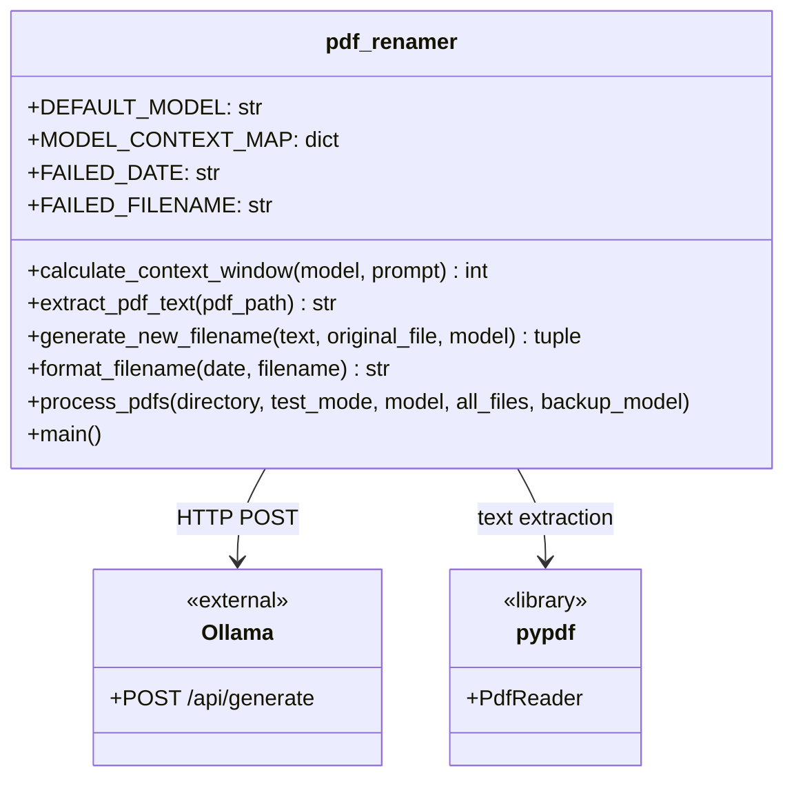
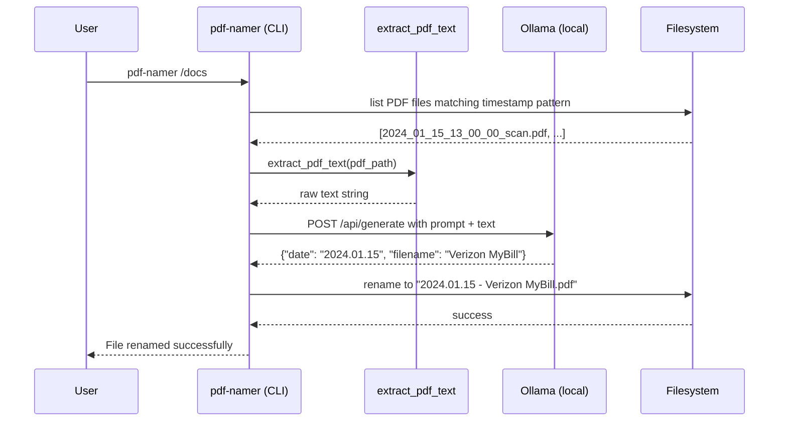

# PDF Namer

A CLI tool that renames PDF files using a locally running Ollama LLM. It extracts text from each PDF, sends it to the model, and renames the file to a structured `YYYY.MM.DD - Descriptive Name.pdf` format.

[](https://github.com/max-rousseau/pdf-namer/actions/workflows/pytest.yml)

## Features

- Extracts text from PDFs using pypdf
- Queries a local Ollama instance to generate a descriptive filename and infer the document date
- Produces consistently formatted filenames: `YYYY.MM.DD - Description.pdf`
- Filenames are capped at 80 characters to stay filesystem-friendly
- Filters by timestamp pattern by default; `--all-files` bypasses the filter
- Test mode prompts for confirmation before each rename
- Optional `--backup-model` flag retries failed fields with a second model

## Architecture

### Class Diagram



### Happy Path Flow



## Usage

```
pdf-namer [OPTIONS] SCAN_DIRECTORY
```

| Option | Description |
|---|---|
| `--test-mode` | Prompt before each rename instead of renaming automatically |
| `--model TEXT` | Ollama model to use (default: `gemma4:31b`) |
| `--all-files` | Process all PDFs, not just those matching the timestamp pattern |
| `--backup-model TEXT` | Fallback model used when the primary fails to extract date or filename |

### Examples

Rename all timestamped PDFs in a directory using the default model:

```bash
pdf-namer /path/to/pdfs
```

Preview renames interactively before committing:

```bash
pdf-namer --test-mode /path/to/pdfs
```

Use a specific primary model with a lighter backup for failed fields:

```bash
pdf-namer --model gemma4:31b --backup-model gemma3:27b /path/to/pdfs
```

Process every PDF in the directory, bypassing the timestamp filter:

```bash
pdf-namer --all-files /path/to/pdfs
```

### File Naming Convention

By default, only files whose names contain a timestamp segment are processed:

```
2024_01_15_13_00_00_scan.pdf  ->  2024.01.15 - Verizon MyBill.pdf
```

Use `--all-files` to process PDFs with any filename.

## Getting Started

### Prerequisites

- Python 3.11 or higher
- [Ollama](https://ollama.com) running locally with at least one supported model pulled

Supported models (others fall back to a 2048-token context):

- `gemma4:31b`
- `gemma3:27b`
- `llama3.1:70b-instruct-q8_0`
- `llama3.1:8b-instruct-fp16`
- `llama3.2:3b-instruct-fp16`

### Install

```bash
git clone https://github.com/max-rousseau/pdf-namer.git
cd pdf-namer
pip install .
```

Ollama must be running and the chosen model must be available before invoking `pdf-namer`:

```bash
ollama serve
ollama pull gemma4:31b
```

## License

BSD 2-Clause — see [LICENSE](LICENSE).
